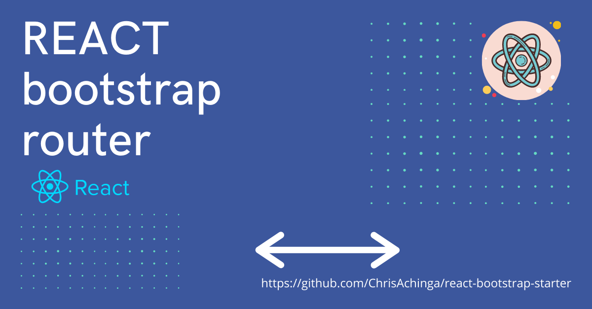

# React Bootstrap Starter



[Documentation](https://chrisdev.hashnode.dev/react-and-bootstrap-starter-template) | [Live Demo](https://react-bootstrap-temp.netlify.app/)

React Bootstrap Starter is a starter template for react and bootstrap created by [Chris Achinga](http://chrisdev.netlify.app). This theme uses Create React App, react-bootstrap and gh-pages.


## Download and Installation

To begin using this template, choose one of the following options to get started:

Fork and clone the repository.

Install the dependencies:

```powershell-interactive
npm install
```

## Usage

Start editing and customizing according to your needs.

Run locally:

```powershell-interactive
npm start
```

## Dependencies:

- [React](https://reactjs.org/)
- [Create React App](https://create-react-app.dev/)
- [react-bootstrap](https://react-bootstrap.github.io/)

## Bugs and Issues

Have a bug or an issue with this template? Open a new issue here on GitHub.

## Copyright and License

Copyright 2021 Chris Achinga. Code released under the [MIT license](LICENSE).

